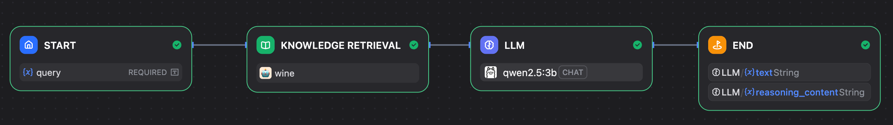

# 🍷 RAG-wine

Lightweight Retrieval-Augmented Generation (RAG) over professional wine reviews.
Ask domain questions (flavor notes, regions, varieties) and see cited evidence chunks.

  

## 🔗 Quick Links
- 📄 **Progress Report**：[`docs/report.md`](docs/report.md)
- 🧠 **Workflow **：[`workflow/rag_workflow.yml`](workflow/rag_workflow.yml)
- 🖥️ **Demo App**：[`app/streamlit_client.py`](app/streamlit_client.py)
