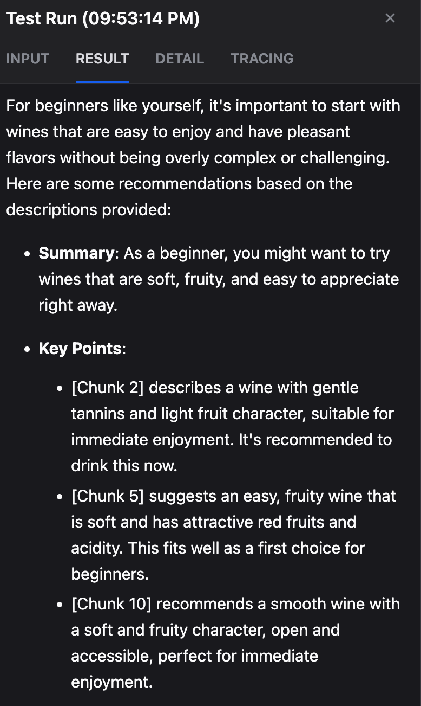

# Wine RAG – Progress Report

## 1. Goal & Summary
- Build a lightweight Retrieval-Augmented Generation (RAG) system over professional wine reviews to answer domain questions (flavor notes, regions, varieties) and cite supporting evidence chunks.
- Current result:
  - The end-to-end Dify workflow runs reliably with qwen2.5-3b (chat) and a hybrid retriever (semantic + keyword).
  - Rerank: not enabled (no rerank model configured).
  - Answer quality: As the dataset was descriptions, it always doing well in summarize and give recommendations, but while needs specific words it always cannot hit the point, but it can give an output related with it.
  - Failure modes: Generic queries without anchors, or ones requiring fields not indexed sometimes yield “can’t find a definitive answer.”
  - Latency: ~2–5 s per query locally (depends on TopK and LLM).

## 2. System Overview
- Workflow: Dify workflow with 3 nodes — Start → Knowledge Retrieval → LLM → End.
- Model: qwen2.5:3b (chat)
- Knowledge Base: 4 CSV shards — part_aa_desc.csv, part_ab_desc.csv, part_ac_desc.csv, part_ad_desc.csv.
  - Ingestion column: text (full review text).
  - Chunking performed at ingest.

## 3. Retrieval Settings
- Retriever: Hybrid (semantic 0.7 / keyword 0.3).; TopK 10; Threshold 0.1; No rerank.
- Chunking: length 800, overlap 32 (tokens/characters per Dify’s unit).

## 4. Demo Cases (with Evidence)

- **Q1: What wine tastes like plum?**
  - **Answer**
    - This likable wine smells sweet and plummy, with red cherry and black-plum flavors spilling over the palate. It tastes smooth, juicy, and fruity.
    - The wine is sweet and jammy, featuring ripe tannins and attractive berry fruits.
    - [Chunk 2] This sweet wine smells like ripe plums and tastes fresh, grapy, and sugary with a little sparkle in texture.
    - [Chunk 5] This rich, smooth wine has ripe fruit and plenty of smooth plum flavors.
  - **Evidence**
    

      
      
    

- **Q2: I am a beginner in wine, give me some recommendations**
  - **Answer**
    - **Summary**: As a beginner in wine, I recommend starting with red wines like Pinot Noir or Cabernet Sauvignon for their balanced flavors and lower tannin levels compared to other types.
    - **Key Points**
      or white wines, try Riesling or Chardonnay; these are generally milder and can be easier on the palate. [Chunk 2]
    

      
      
    

## 5. Failure cases and improvements
- Observed failures：
  - Zero-hit or low-confidence queries
  - Ranking drift without rerank
  - Over-strict prompting
- Planned improvements：
  - Add a reranker to reorder TopK before LLM.
  - Query rewriting: add a “Query Reformulator” LLM step to expand synonyms (e.g., black currant ↔ cassis, dark fruit ↔ blackberry/black cherry).
  - Add something new things (e.g. add Jazz music dataset to this and blend them to answer multiple questions).
  - improving the wine dateset, not only with descriptions.
